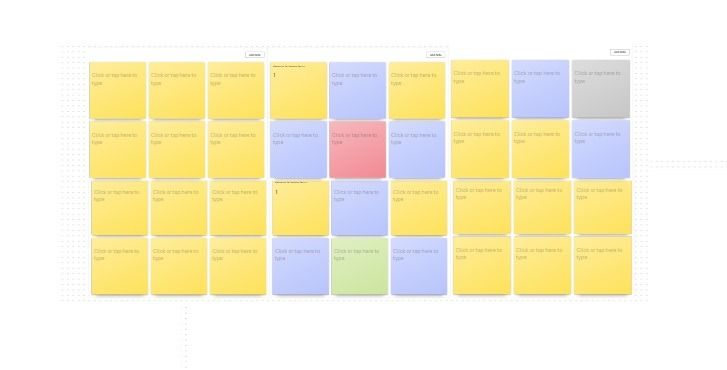

# Mesh Bubble Game

## Main Components

	•	Players: 2-8 participants
	•	Game Board: A grid of cells with dimensions M by N
	•	Color Bubbles/Balls

## Objective   

The primary objective of the game is to conquer all the cells on the board by eliminating all opponents.

## Setup

	1.	Determine the number of players.
	2.	Select the size of the board/grid.
	3.	Each player selects a color.

## Game Play

- Player 1 initiates the game, followed by Player 2, continuing in sequence until all players have taken their turns.
- Player 1 resumes their turn once all players have completed theirs.
- During a turn, a player is allowed to perform only one action: place one bubble/ball in a cell on the grid, which must be either empty or already occupied by a bubble of the same color.

        For instance, if a player is using red bubbles, they may place a red bubble in any empty cell or a cell already containing red bubbles. Placing a red bubble in a cell occupied by a different color is not permitted.
- Every cell in the grid maintains a count of the number of bubbles placed in it.

## Adjacent cells

Any cell that is on the top, bottom, left, right is considered an adjacent cell. 

        For instance, in the above grid, the green cell has three adjacent cells, the red cell has four adjacent cells, and the corner grey cell has only two adjacent cells.
     

## Blasting Bubbles

- When the count of bubbles in a cell reaches the number of its adjacent cells, the bubbles in that cell will blast.
- When a cell blasts, it becomes empty, and each adjacent cell receives one bubble of the blasting color.
- The color of adjacent cells changes to the blasting color if they receive a bubble.

       For instance, if a cell with red bubbles blasts, the adjacent cells will each receive one red bubble. If an adjacent cell is empty, it will receive one red bubble. If an adjacent cell already contains one green bubble, it will change its color to red and will now have two red bubbles.

- Blasts can be cascading.

        If a cell blasts, a bubble is added to all the adjacent cells. If the count of bubbles in any of the adjacent cells reaches its limit, it will blast, and the process will continue. 

## Eliminating a player

- Players can capture other players’ cells through blasts.
- A player will be eliminated from the game if all their bubbles are captured by other players before their turn.
- The game continues with the remaining players.

## Winning

- A player wins by capturing all the cells and eliminating all opponents.

